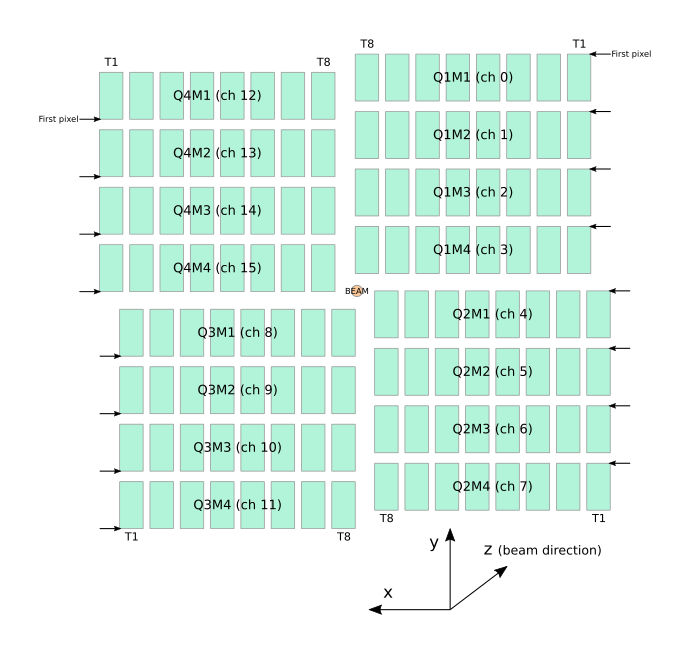
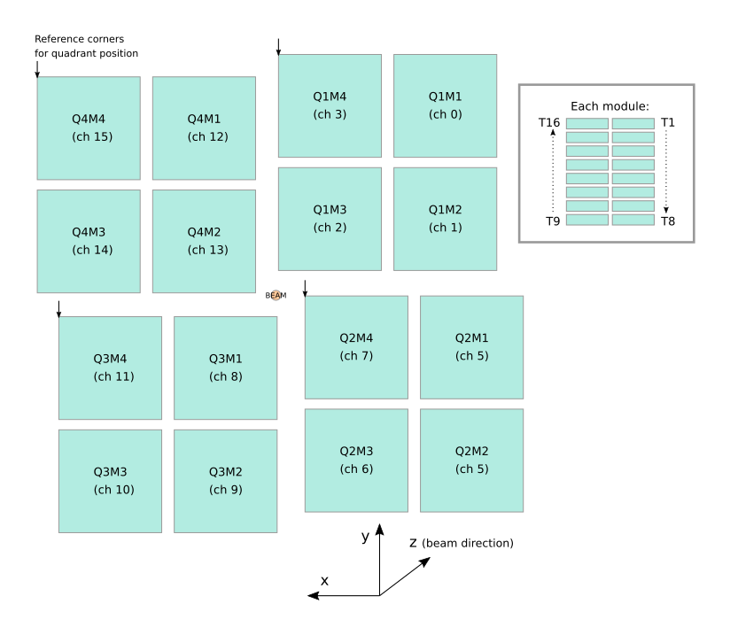

AGIPD & LPD Geometry
====================

.. module:: karabo_data.geometry2

The AGIPD and LPD detectors are made up of several sensor modules,
from which separate streams of data are recorded.
Inspecting or processing data from these detectors therefore depends on
knowing how the modules are arranged. The module :mod:`karabo_data.geometry2`
handles this information.

All the coordinates used in this module are from the detector centre.
This should be roughly where the beam passes through the detector.
They follow the standard European XFEL axis orientations, with x increasing to
the left (looking along the beam), and y increasing upwards.

.. note::

   This module includes methods to assemble data into a single array.
   This is sufficient for a quick examination of detector images, but the
   detector pixels may not line up with the grid imposed by a single array.
   For accurate analysis, it's best to use a tool that can process
   geometry internally with sub-pixel precision.

AGIPD-1M
--------

AGIPD-1M consists of 16 modules of 512×128 pixels each.
Each module is further subdivided into 8 tiles.
The layout of tiles within a module is fixed by the manufacturing process,
but this geometry code works with a position for each tile.

   The approximate layout of AGIPD-1M, in a front view (looking along the beam).

.. autoclass:: AGIPD_1MGeometry

   .. automethod:: from_quad_positions

   .. automethod:: from_crystfel_geom

   .. automethod:: write_crystfel_geom

   .. automethod:: to_distortion_array

   .. automethod:: plot_data_fast

   .. automethod:: position_modules_fast

   .. automethod:: position_modules_interpolate

   .. automethod:: inspect

   .. automethod:: compare

LPD-1M
------

LPD-1M consists of 16 supermodules of 256×256 pixels each.
Each supermodule is further subdivided into 16 sensor tiles,
which this geometry code can position independently.

   The approximate layout of LPD-1M, in a front view (looking along the beam).

.. autoclass:: LPD_1MGeometry

   .. automethod:: from_quad_positions

   .. automethod:: from_h5_file_and_quad_positions

   .. automethod:: plot_data_fast

   .. automethod:: position_modules_fast

   .. automethod:: inspect
